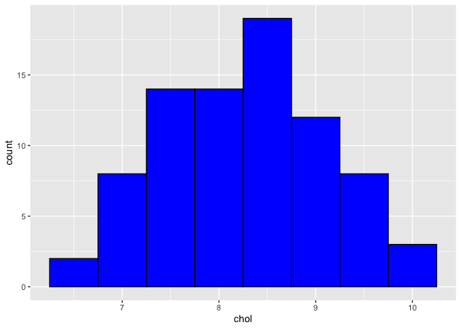
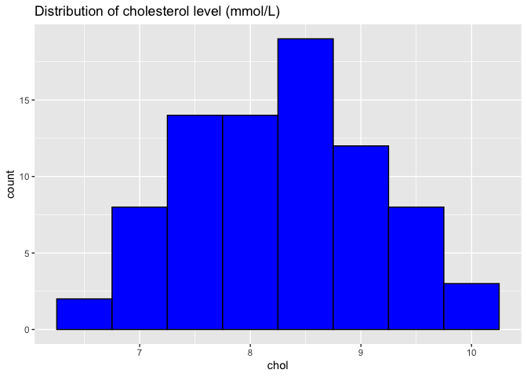
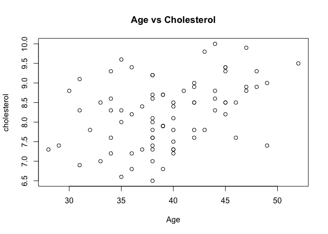
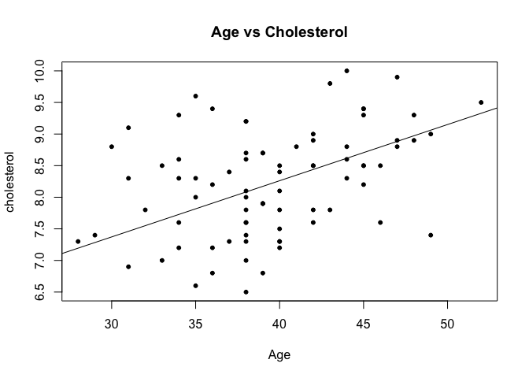

# Create the environment


```r
library(readxl)
library(dplyr)
```

```
## 
## Attaching package: 'dplyr'
```

```
## The following objects are masked from 'package:stats':
## 
##     filter, lag
```

```
## The following objects are masked from 'package:base':
## 
##     intersect, setdiff, setequal, union
```


```r
Chol <- read_excel("cholest.xls")
```

View the data using several methods

1.  First 6 rows


```r
tail(Chol)
```

```
## # A tibble: 6 × 5
##    chol   age exercise   sex categ
##   <dbl> <dbl>    <dbl> <dbl> <dbl>
## 1   9.4    45        4     0     2
## 2   9.5    52        4     0     2
## 3   9.6    35        4     0     2
## 4   9.8    43        3     0     2
## 5   9.9    47        3     0     2
## 6  10      44        3     0     2
```

2.  Structure of data set


```r
str(Chol)
```

```
## tibble [80 × 5] (S3: tbl_df/tbl/data.frame)
##  $ chol    : num [1:80] 6.5 6.6 6.8 6.8 6.9 7 7 7.2 7.2 7.2 ...
##  $ age     : num [1:80] 38 35 39 36 31 38 33 36 40 34 ...
##  $ exercise: num [1:80] 6 5 6 5 4 4 5 5 4 6 ...
##  $ sex     : num [1:80] 1 1 1 1 1 1 1 1 1 1 ...
##  $ categ   : num [1:80] 0 0 0 0 0 0 0 0 0 0 ...
```

3. To convert sex into factor/categoricaldata

```r
Chol_1 <- Chol %>% 
  mutate(sex = factor(sex, labels = c("male", "female")),
         categ = factor(categ,labels = c("Group A", "Group B","Group C")))
```

4. Again we look at back at dataset


```r
str(Chol_1)
```

```
## tibble [80 × 5] (S3: tbl_df/tbl/data.frame)
##  $ chol    : num [1:80] 6.5 6.6 6.8 6.8 6.9 7 7 7.2 7.2 7.2 ...
##  $ age     : num [1:80] 38 35 39 36 31 38 33 36 40 34 ...
##  $ exercise: num [1:80] 6 5 6 5 4 4 5 5 4 6 ...
##  $ sex     : Factor w/ 2 levels "male","female": 2 2 2 2 2 2 2 2 2 2 ...
##  $ categ   : Factor w/ 3 levels "Group A","Group B",..: 1 1 1 1 1 1 1 1 1 1 ...
```
5. View the subset of the data frame age


```r
Chol_1 $ age
```

```
##  [1] 38 35 39 36 31 38 33 36 40 34 38 40 40 28 37 38 49 29 40 38 34 46 42 38 32
## [26] 43 42 40 38 39 39 39 35 38 40 38 45 36 31 34 44 35 40 37 33 46 42 40 45 42
## [51] 45 38 34 44 39 38 39 47 41 44 30 48 47 42 42 49 31 38 38 48 34 45 45 36 45
## [76] 52 35 43 47 44
```
6. Summary of the data set


```r
summary(Chol_1)
```

```
##       chol            age           exercise         sex         categ   
##  Min.   : 6.50   Min.   :28.00   Min.   :2.000   male  :40   Group A:25  
##  1st Qu.: 7.60   1st Qu.:36.00   1st Qu.:4.000   female:40   Group B:33  
##  Median : 8.30   Median :39.00   Median :4.000               Group C:22  
##  Mean   : 8.23   Mean   :39.48   Mean   :4.225                           
##  3rd Qu.: 8.80   3rd Qu.:43.25   3rd Qu.:5.000                           
##  Max.   :10.00   Max.   :52.00   Max.   :6.000
```
## Descriptive statistic

Numerical variable

1. mean of variable age


```r
mean(Chol_1 $ age)
```

```
## [1] 39.475
```

2. standard deviation for age


```r
sd (Chol_1 $ chol)
```

```
## [1] 0.8386849
```

3. Median for age


```r
median(Chol_1 $ age)
```

```
## [1] 39
```

Categorical variable


```r
summary(Chol_1 $ sex)
```

```
##   male female 
##     40     40
```

2. Proportion for categorical data


```r
prop.table(table(Chol_1 $ categ)) *100
```

```
## 
## Group A Group B Group C 
##   31.25   41.25   27.50
```

To view aand count the percentage together


```r
cbind(count = table (Chol_1$categ),
"%" = prop.table(table(Chol_1 $ categ)) *100)
```

```
##         count     %
## Group A    25 31.25
## Group B    33 41.25
## Group C    22 27.50
```
Visual exploration


```r
library(ggplot2)
```


```r
ggplot(Chol_1, aes(x=chol)) +
  geom_histogram(binwidth = 0.5,
                 colour = "black", fill = "blue")
```

<!-- -->
2. Add title to histogram


```r
ggplot(Chol_1, aes(x=chol)) +
  geom_histogram(binwidth = 0.5,
                 colour = "black", fill = "blue") +
  ggtitle("Distribution of cholesterol level (mmol/L)")
```

<!-- -->
3. Plotting relationship between numerical variable

Basic scatter plot


```r
plot(Chol_1 $ age, Chol_1 $ chol, main = "Age vs Cholesterol",
     xlab = "Age", ylab = "cholesterol")
```

<!-- -->
add regression line


```r
plot(Chol_1 $ age, Chol_1 $ chol, main = "Age vs Cholesterol",
     xlab = "Age", ylab = "cholesterol", pch = 20)
abline(line(Chol_1 $ age, Chol_1 $chol))
```

<!-- -->
4. 
